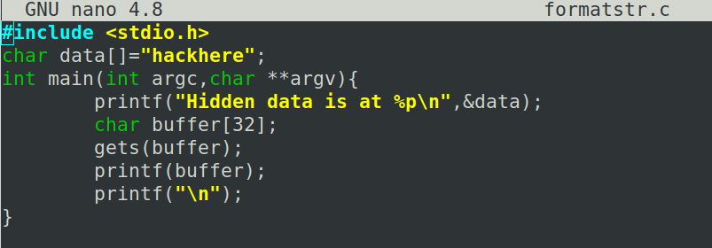

# EXPLOITING FORMAT STRING VULNERABILITY

## WHAT IS FORMAT STRING VULNERABILITY?

A Format String attack can occur when an input string data is processed by a vulnerable function so that attacker can pass the formats to exploit the stack values with the help of format string functions/printf() family functions

By format String vulnerability, an attacker can execute code, read the stack values, or cause a segmentation fault in the application

## COMMON FORMATS IN PRINTF() FAMILY

1. %c - Formats a single character
2. %d - Formats an integer in decimal value
3. %f - Formats float in decimal value
4. %p - Formats a pointer to address location
5. %s - Formats a string
6. %x - Formats a hexadecimal value
7. %n - Number of bytes written

## VULNERABLE FUNCTIONS TO FORMAT SRING 

1. printf()
2. fprintf()
3. sprintf()
4. vprintf()
5. snprintf()
6. vsnprintf()
7. vfprintf()
8. vfprintf()

## WHY DOES FORMAT STRING VULNERABILITY OCCUR

When we pass the input with format strings it gets called by the printf() to display as output

So if the input has valid data with respect to the formats it gets printed correctly

If the data has irrelevant format values with respect to printf() it can be exploited

Example:
	
	1. If printf(data) is used, I can pass "junkdata %d %p %lp %x" to exploit the function
	2. If printf("%s %p %p",data), here data gets filled by %s and the remaining formats can get exploited into stack

When the format string does not have a corresponding variable to call the data, it will start popping random values from stack irrespective of their location/address

## EXPLOITATION

### EXAMPLE 1

Lets consider a simple program to test this vulnerability

Compiling tgis binary with GCC (no flags)

When we pass a normal string data, it prints it successfully

If we pass beyond the buffer it gets crashed

But if we pass string with format values, it give us the random stack values which is being popped from it

We are passing '%p' to get address values in pointer format

Lets pass some data infront of format values

We can see our input from stack values at 6th position

Passing string inputs like this can help us to locate the position of our data, so that it can be useful for exploitation

Now we have traced the location from where our inputs get stored in stack

There is a chance that the application may crash when we call different format from the address which it does not have

We have passed our input with AAAABBBB

A -----> 0x41

B -----> 0x42

Since we are running in 64bit, we can store upto 8bytes in each address 

We have located the place where our input gets stored & we are veiwing it as pointer address from stack

When we try to call that location with '%s' format, "SEGMENTATION FAULT" occurs

Because the address with 0x4242424241414141 does not have any string in it or it was out of bound with the memory of the application

So error occurs, be sure of the address and type of the format you are trying to call

The address you are going to call should have a value in it which can support the type of format you need

### EXAMPLE 2

Lets try to get some data which is not being used in the application

Here we use a global variable 'data' which has some string in it

And we are printing the address of the variable in it

Lets compile the program using GCC, for 32 bit

By testing this application with inputs (fuzzing process)

You can see that our inputs get printed from the 11th location of the memory output

You can "directly" reference the location in format string vulnerability to call the values from stack at your desired location

To print the stack values from 11th location you can use '%11$p' to represent the 11th location of the stack

Lets pass the address of the 'data' as our second input so that it gets stored in stack next to the first input

Pass the address in reverse order if "LITTLE ENDIAN"

#### NOTE

	Always remember to fill with 8 bytes or else the address / expected value may get broken

Now our second data is at 12th place

We know that there is some string data in it, but we don't know what it is

So we pass '%s' format to read it as string from the stack memory

By passing '%s' at 12th place

Lets make our payload with '%s'

Passing our payload with '%s' makes us to view the data in 12th place as string

We can also do more exploitation with this vulnerability by accessing stack further more

## MITIGATIONS

1. Use format strings corresponding to the assigned variables

2. Use of “%s” as format string can make the whole input as a single string

3. Use arguments to call values and functions

4. Defensive strategy like 'format_gaurd' can be used

-----

#### Exploit Sample Is Given In GitHub Repo

#### [AidenPearce369](https://github.com/AidenPearce369/ExploitDev)
