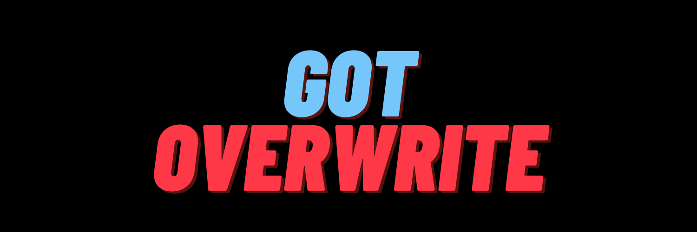
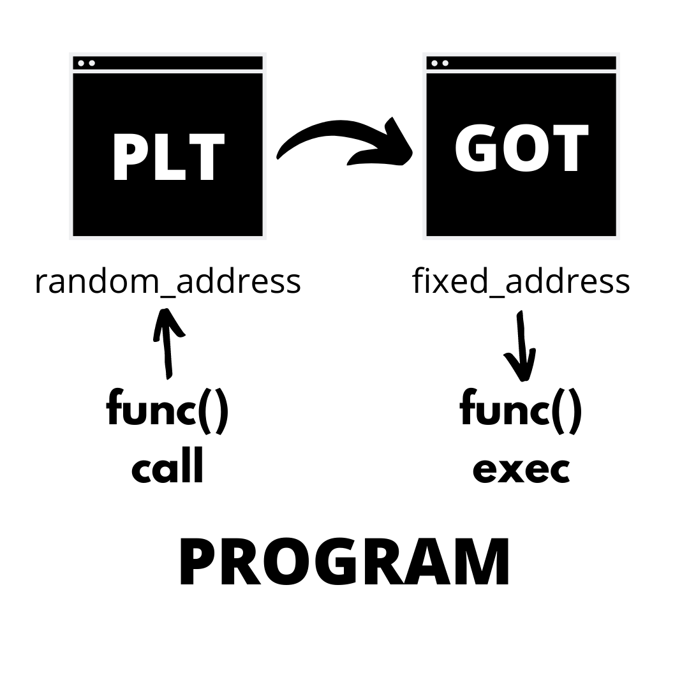
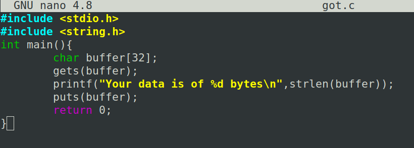
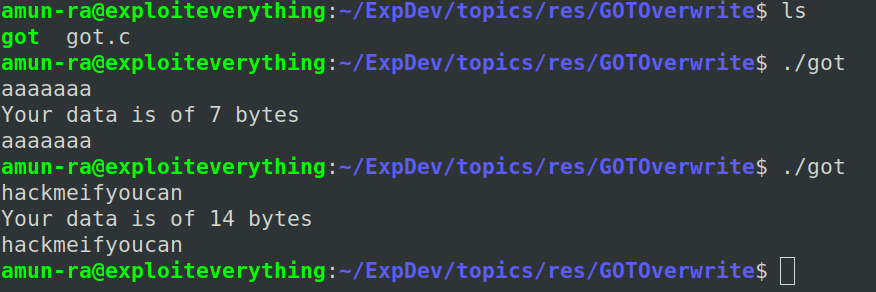
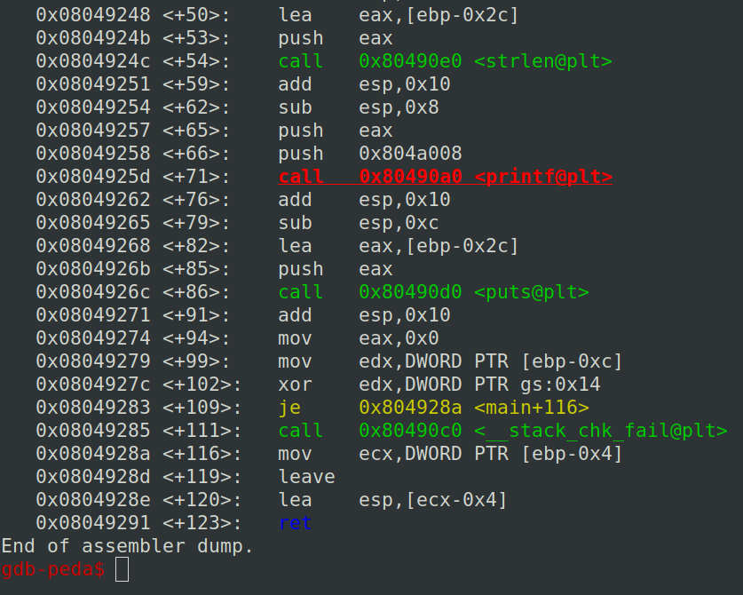
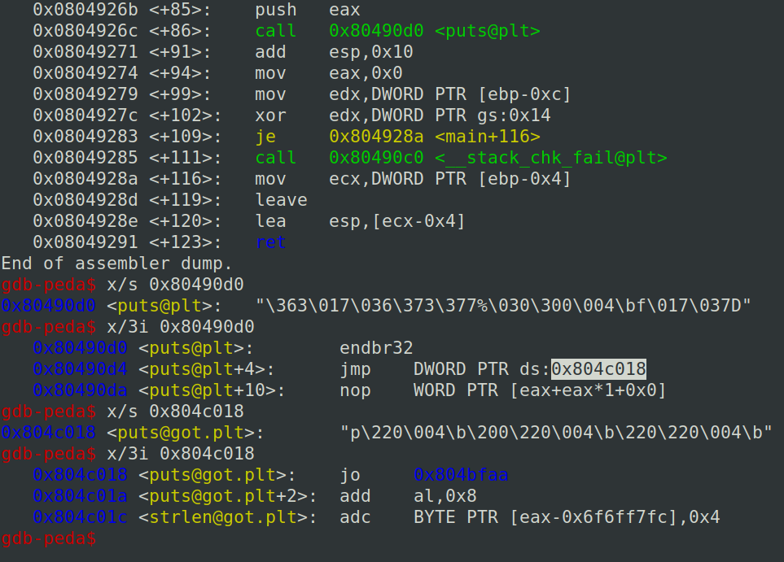
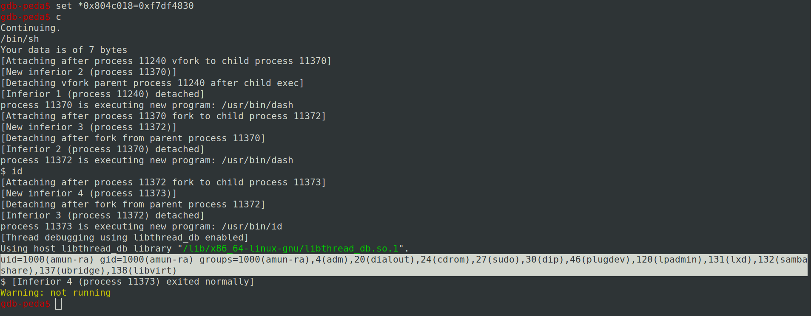

# SPAWN SHELL USING SIMPLE GOT OVERWRITE

-----



## UNDERSTANDING BASICS

## PROCEDURE LINKAGE TABLE (PLT)

Procedure Linkage Table(PLT) is a "read-only" section

It is responsible for calling the dynamic linker during and after the program runtime to resolve the addresses of the requested functions

During compilation we cannot mention these addresses because the function addresses of each system is unknown and shared object is also unavailable

So,PLT plays a vital role in resolving these function addresses during runtime

PLT table is much larger than the GOT table

Each program/binary has its own PLT table which is useful to itself only

When symbol resolution is requested, the request is made to the PLT by the calling function, and the address of the GOT is pushed into a processor register

This is how shared library functions are called via binaries to execute their desired functions

## GLOBAL OFFSET TABLE (GOT)

Global Offset Table(GOT) is popped by a dynamic linker during programming runtime

Dynamic linker obtains the absolute addresses of requested functions and updates the GOT as requested

Files do not need to be relocatable because the GOT takes requests for locations from the Procedure Linkage Table (PLT)

Many functions will not be resolved at runtime and get resolved only on the first call to the requested function

This is a process known as "lazy linking", which saves on resources

Once a PLT address of a function is linked with GOT address of the function in a program, the program can call that specific function from libraries directly with the help of PLT-GOT translation

## WORKING OF PLT-GOT



-----

## GOT OVERWRITE

GOT Overwrite is a binary exploitation technique where the GOT address of a function is replaced with the address of our desired function

Assume we are going to call "printf()" in the program

When a "printf()" inside the program is called it checks the PLT table first

While checking the PLT table of the "printf()" function, it seeks for the GOT address of "printf()" to run the function so that "printf()" can be called from library directly

If we overwrote the GOT address of "printf()" with another desired function's address

When "printf()" is called it goes to PLT and acquires the manipulated GOT address and executes our desired function

Arguments required for "printf()" will also be passed into our desired function

Thats how we can overwrite GOT values to execute our desired function

-----

## EXPLOITATION

Lets perform GOT Overwrite with this source code



Here simple functions like gets(),puts(),strlen() are used

This program doesn't do any complex operations,just a simple program

Lets compile this program


Now, lets try to execute this program normally



Disassembling the program using GDB-PEDA




Here we can see that many functions are called using PLT table

Now lets check the PLT address of "puts()"



Here 0x80490d0 is the PLT address value of "puts()"

To get the GOT address of "puts()", lets check into PLT of "puts()"

Every GOT needs to be called from PLT

Viewing the JMP instruction

GOT address of "puts()" is 0x804c018

Now lets redirect our "puts()" to "system()"

To find "system()" address


Its time to set the GOT of "puts()" with the address of "system()"

If we overwrote that, whenever "puts()" is called "system()" executes

After manipulating the GOT address we will be passing our data into "buffer" using "gets()"

In our actual program "puts(buffer)" is passed, so that it will print the data from "buffer"

Data from "buffer" is passed as argument to "puts()"

Since we overwrote "puts()" with "system()", the argument from "buffer" will be passed into "system()"


This is a potential RCE

So, if we pass "/bin/sh" into "system()" as argument from "buffer"

It works like

```
system("/bin/sh");
```

Opening a shell for us



Thus GOT overwrite is performed to spawn shell in this simple program


