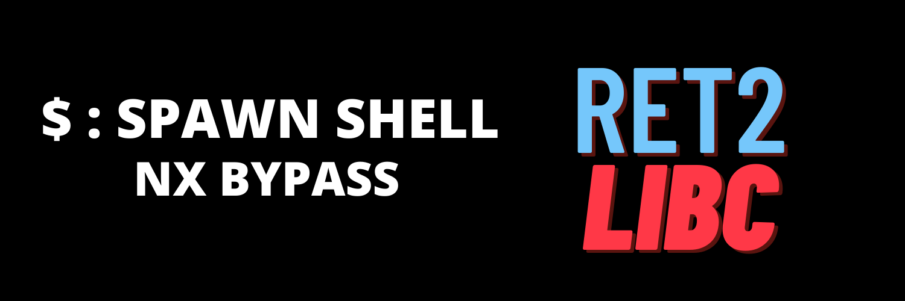
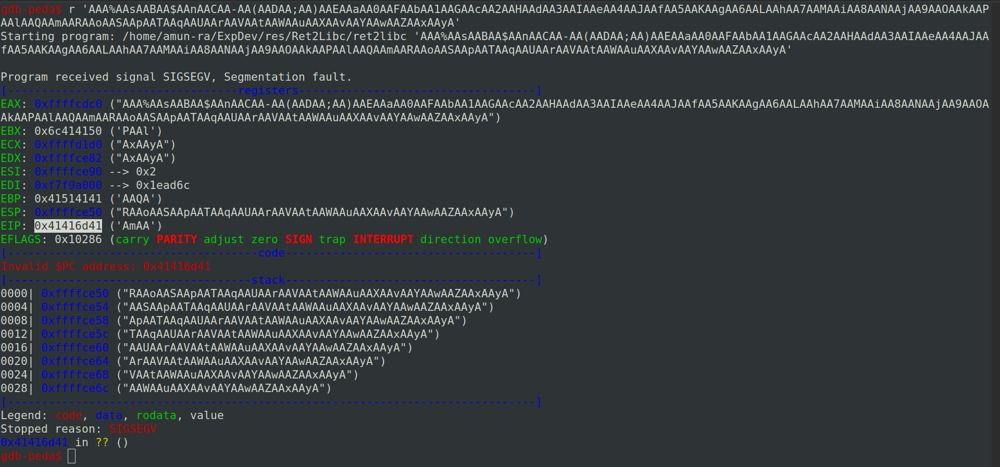
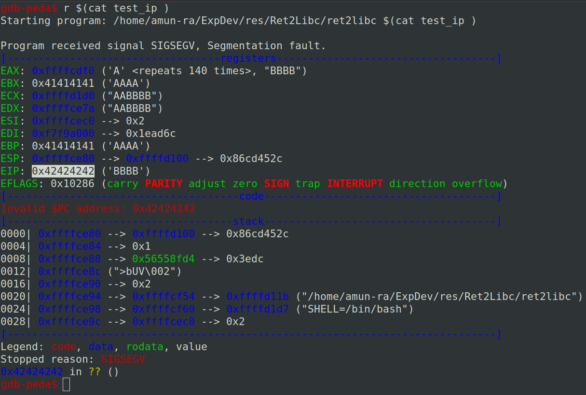
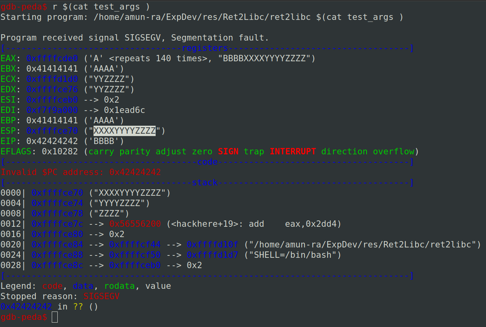
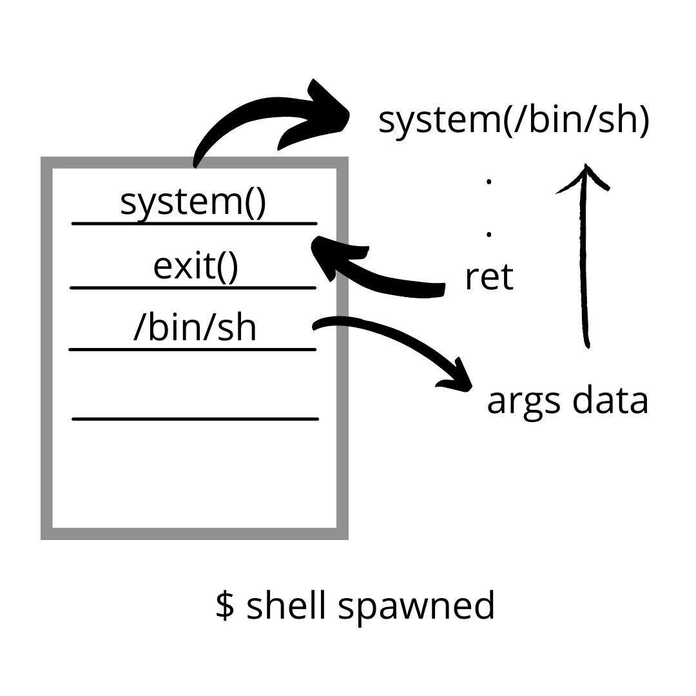
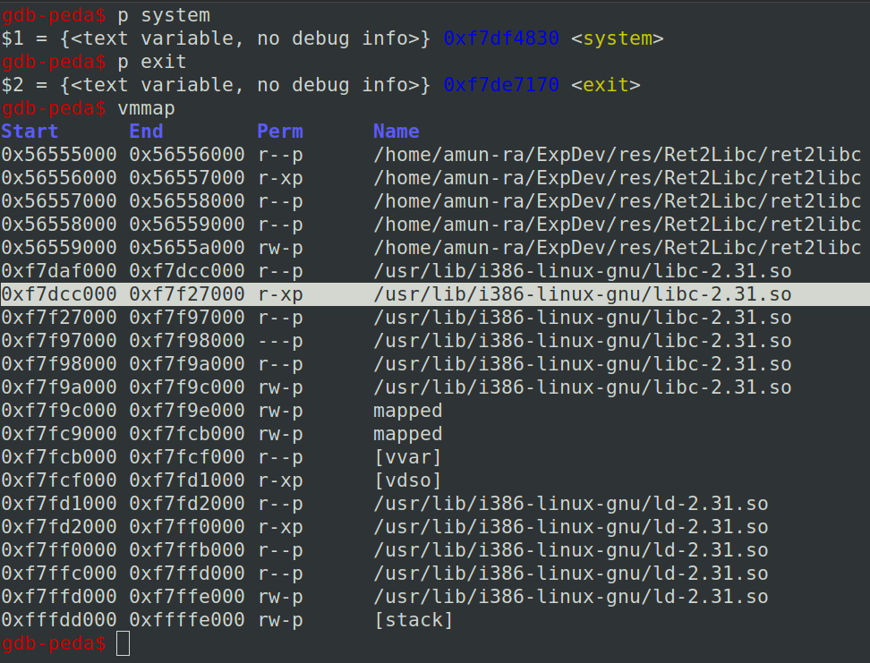

# Ret2Libc EXPLOIT
-----

## Ret2Libc ---> Return To LIBC



## LIBC

The term "libc" is commonly used as a shorthand for the "standard C library", a library of standard functions that can be used by all C programs (and sometimes by programs in other languages).

For more on [LIBC](https://man7.org/linux/man-pages/man7/libc.7.html)

## METHODOLOGY

Whenever a function is called by a program, the arguments required for this function are loaded into stack so that it can be pointed by Base Pointer(BP) easily to process the instructions.

We cannot point an arbitraty address into Instruction Pointer (IP) to run our shellcode from that address.

This will fail, because there is no execution of shellcode when NX bit is enabled.

#### The common way to bypass NX bit protection is to try ret2libc attack

In this attack, we would be loading the function arguments directly into stack so that it can be called by other function we need.

#### WORKING MECHANISM 

So in order to make this work,

1. We would be passing our arguments of the function into the stack by loading it into buffer space

2. Pointing our Instruction Pointer(IP) to another function which uses our passed inputs as arguments

3. Return function to execute when the program comes out of the pointed function

#### WHAT TYPE OF FUNCTIONS NEED TO BE POINTED

Reusable functions need to be pointed in Instruction Pointer (IP)

These functions can be inbuilt in the program or it can be called from libraries

For ret2libc, the function should be from LIBC

## EXPLOITATION

In Ret2Libc attack we will be pointing functions from LIBC library

That is how this attack got its name, "ret2libc"

When it comes to LIBC, each function inside this library is present at fixed offset from the base of the library

If library version and library base value address is known,we can calculate the address of any function from it easily

To calculate the function address in LIBC , [Click Here](https://libc.blukat.me/)

### SPAWNING SHELL USING RET2LIBC

Lets consider a vulnerable program as an example for this attack


Lets compile this binary in 32 bit mode


We did not use ``` -z execstack ``` to make the stack executable

Lets run "checksec" to check the security protections of this binary file


So our NX bit should be enabled, to avoid execution in stack

#### CRASHING OUR PROGRAM

Lets check that this program can be crashed or not


This program crashes when we pass input larger than the buffer size

#### FINDING OFFSET

After confirming the program crash

We need to find the offset of the Instruction Pointer (IP)

So that we can pass our payload precisely into the buffer

Lets create a random pattern in GDB-PEDA to pass it as input to find the offset value


Passing this pattern into the buffer our program crashes again



We can see that our Base Pointer (BP), Instruction Pointer (IP) are overwritten with the values from the pattern generated


Now we found the offset value of Instruction Pointer (IP) from the pattern value

#### CONTROLLING INSTRUCTION POINTER

Lets craft an input data in python to test whether we can overwrite the Instruction Pointer (IP) correctly or not


After our program crash, by checking the registers we can say that our input data overwrote the registers successfully



Our Instruction Pointer (IP) is filled by 0x42424242

So we control the Instruction Pointer (IP) now

#### FORMING RET2LIBC

To perform ret2libc successfully,we need an usable and executable function with arguments

A return function to execute in case if we need to exit the function without crash (if needed)

Before that lets check our data in stack


Program crashes again



So our data 'XXXXYYYYZZZZ' gets stored in Stack Pointer (SP) correctly

In the place of 'XXXXYYYYZZZZ' we will be passing arguments which will be executed by the function when called

So the key to perform ret2libc depends on the values in the following order

1. Function needed to be called from Instrcution Pointer (Function is present in LIBC)

2. Return Function which will be executed when 1st function is exited 

3. Arguments to be passed 



Here to spawn shell we will be calling "system()" from LIBC

And passing "/bin/sh" as arguments it will spawn $

This is similar to,

```system('/bin/sh')```

The value "/bin/sh" should not be passed as string

It should be pointed from an address

When shell is spawned successfully,we need an exit function or else the program would crash

Here for this purpose we use "exit()" which is a simple exit function

To get the address of these functions, we can use GDB-PEDA to search it easily



Here we got the address of "system()" and "exit()" from LIBC

We can also see that these addresses lies in the region of executable memory of LIBC,such functions can only be used for ret2libc attack

Finding "/bin/sh" pointer


We can alose export an environment variable for our desired arguments and call it as pointers to perform ret2libc

#### GENERATING EXPLOIT

Now with these address values lets craft our exploit in python


Do not forget to convert these addresses to little endian (If processor is little endian)


Passing this exploit inside GDB debugger, we can see PIDs


So the shell is being spawned,it also printed the output of the command

Lets try it out of the debugger

 

or we can also run it from the script


Sometimes your exploit may fail due to improper STDIN handling

To overcome that you can use ```(cat payload;cat) | ./ret2libc```

#### EXPLOIT IS DONE

#### RET2LIBC IS PERFORMED

-----

#### Exploit Sample Is Given In GitHub Repo

#### [AidenPearce369](https://github.com/AidenPearce369/ExploitDev)


